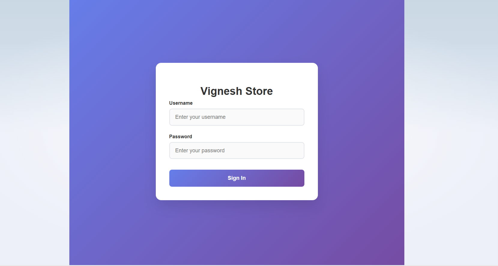
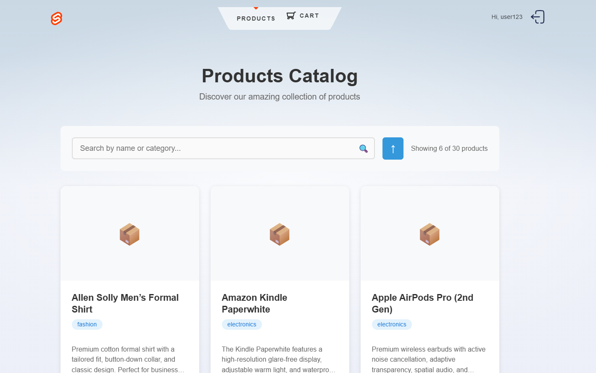
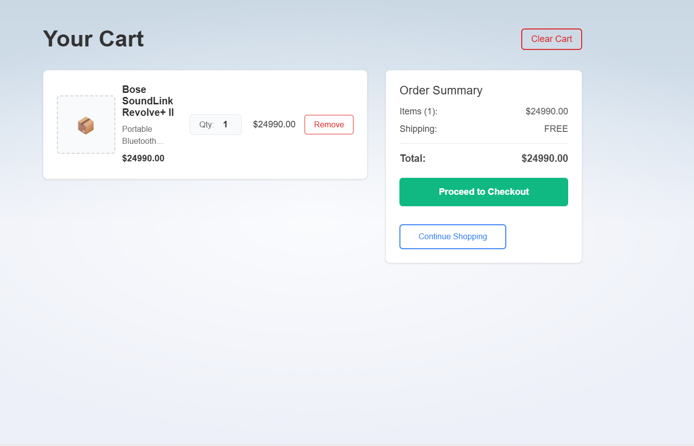

# 🛒 E-Commerce SvelteKit Application


### **Video Recording available in demo.mp4 file .**

A modern, responsive e-commerce application built with **SvelteKit** frontend and **Docker-based microservices** backend architecture.


*Complete walkthrough: login → product browsing → cart management → checkout*

## 🚀 Features

### 🔐 **Authentication System**
- Secure user login/logout
- Token-based authentication
- Route protection (public/private routes)
- Automatic redirects based on auth status

### 🛍️ **Product Catalog**
- **Responsive Product Grid** - Optimized for all devices
- **Smart Search** - Search by product name or category
- **Intelligent Sorting** - Sort by name, price, category, stock
- **Client-Side Pagination** - 6 products per page with smooth navigation
- **Product Details** - Dedicated detail pages with full product information
- **Stock Management** - Real-time stock status display

### 🛒 **Shopping Cart**
- **Add to Cart** - From both product list and detail pages
- **Cart Management** - View, remove items, clear entire cart
- **Real-time Updates** - Instant cart count updates in header
- **Responsive Design** - Optimized cart experience across devices
- **Order Processing** - Seamless checkout with order placement

### 📱 **Responsive Design**
- **Mobile-First** approach
- **Touch-Friendly** interactions
- **Adaptive Layouts** that work on all screen sizes
- **Optimized Performance** across devices

## 🖼️ Application Screenshots

### 🔑 Login Page
Beautiful gradient login form with secure authentication


### 📦 Products Catalog
Feature-rich product browsing with search, sort, and pagination


### 🔍 Product Details
Comprehensive product information with add to cart functionality


### 🛒 Shopping Cart
Clean cart interface with order summary and checkout


## 🏗️ Architecture

### **Frontend (SvelteKit)**
- **Framework**: SvelteKit with SSR support
- **Styling**: Modern CSS with responsive design
- **State Management**: Svelte stores with localStorage persistence
- **Routing**: File-based routing with dynamic routes
- **API Integration**: RESTful API consumption

### **Backend (Microservices)**
- **API Gateway**: Central routing and load balancing
- **Auth Service**: User authentication and authorization
- **Product Service**: Product catalog management
- **Cart Service**: Shopping cart operations
- **Order Service**: Order processing and management
- **Service Discovery**: Consul for service registration
- **Message Queue**: RabbitMQ for async communication

## 🚀 Getting Started

### Prerequisites
- **Node.js** (v18 or higher)
- **Docker** and **Docker Compose**
- **Git**

### 📦 Installation

#### 1. Clone the Repository
```bash
git clone https://github.com/vigneshactech2015/ecommerce-svelte
cd ecommerce-svelte
```

#### 2. Start Backend Services
```bash
# Start all microservices
docker-compose up --build
```
**Backend will be available at:** `http://localhost:3000`

#### 3. Start Frontend Application
```bash
# Install dependencies
npm install

# Start development server
npm run dev
```
**Frontend will be available at:** `http://localhost:5173`

### 🔑 Login Credentials
```
Username: user123
Password: password
```

## 🛠️ Technology Stack

### **Frontend**
- 
- 
- 
- 

### **Backend**
- 
- 
- 
- 

## 🌐 API Endpoints

### **Authentication**
- `POST /api/auth-service/auth/login` - User login

### **Products**
- `GET /api/product-service/products` - Get all products
- `GET /api/product-service/products/:id` - Get product details

### **Cart**
- `GET /api/cart-service/cart/:userId` - Get user cart
- `POST /api/cart-service/cart/add` - Add item to cart
- `POST /api/cart-service/cart/remove` - Remove item from cart
- `DELETE /api/cart-service/cart/:userId` - Clear entire cart

### **Orders**
- `POST /api/order-service/order/place` - Place order

## ✨ Key Features Deep Dive

### 🔍 **Smart Search & Filtering**
- **Real-time search** as you type
- **Multi-field search** (name + category)
- **Case-insensitive** matching
- **Instant results** without page reload

### 📄 **Advanced Pagination**
- **Smart page numbering** (shows relevant pages)
- **Configurable items per page** (currently 6)
- **Previous/Next navigation**
- **Page info display** (e.g., "Page 2 of 5")

### 🛒 **Reactive Cart System**
- **Instant updates** when items are added
- **Live cart count** in header
- **Persistent cart state** during session
- **Optimistic UI updates**

### 📱 **Responsive Design Highlights**
- **Mobile-first CSS** with progressive enhancement
- **Touch-friendly buttons** and interactions
- **Flexible grid layouts** that adapt to screen size
- **Optimized typography** for readability

## 🎯 User Journey

1. **🔑 Authentication**: User logs in with credentials
2. **🏠 Home Redirect**: Automatically redirected to products
3. **🔍 Product Discovery**: Browse, search, and filter products
4. **📱 Product Details**: View detailed product information
5. **🛒 Add to Cart**: Add desired items to shopping cart
6. **💰 Checkout**: Review cart and place order
7. **✅ Confirmation**: Receive order confirmation


### **Docker Services**
```bash
docker-compose up --build    # Start all services
docker-compose down          # Stop all services
```

## 🚦 Service Health

| Service | Port | Status | Description |
|---------|------|--------|-------------|
| API Gateway | 3000 | ✅ | Main API entry point |
| Auth Service | 3001 | ✅ | Authentication |
| Product Service | 3002 | ✅ | Product management |
| Cart Service | 3003 | ✅ | Shopping cart |
| Order Service | 3004 | ✅ | Order processing |
| Notification Service | 3005 | ✅ | Notifications |
| Inventory Service | 3006 | ✅ | Stock management |
| Consul | 8500 | ✅ | Service discovery |
| RabbitMQ | 5672/15672 | ✅ | Message queue |


## 👨‍💻 Author

**Vignesh**
- GitHub: [@vigneshactech2015](https://github.com/vigneshactech2015)

